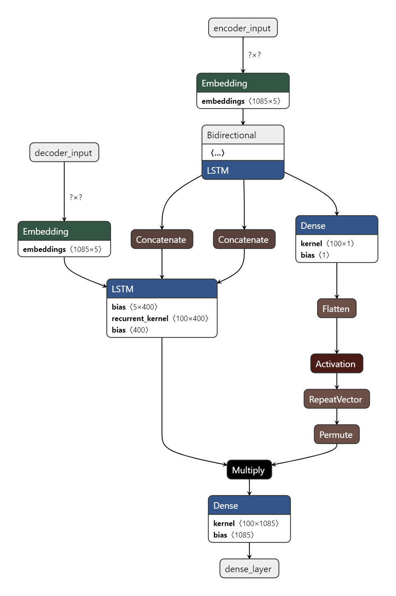

目录

- [OSSAS ChatBot](#ossas-chatbot)
- [**使用方法**](#使用方法)
  * [配置文件介绍](#配置文件介绍)
  * [QQRecord2Excel](#qqrecord2excel)
    + [基本功能](#基本功能)
    + [拓展功能](#拓展功能)
  * [OSSAS](#ossas)
  * [CoolQ](#coolq)
  * [保存模型](#保存模型)
- [错误反馈](#错误反馈)
- [代码介绍](#代码介绍)
  * [程序简图](#程序简图)
- [更新记录](#更新记录)

# OSSAS ChatBot

​	嗨，这是一个基于Keras搭建的单轮中文聊天机器人！

​	这是我学习机器学习两个月的结果，所以或多或少会有不足。

​	模型采用Encoder-Decoder结构，Encoder采用BiLSTM，Decoder采用LSTM。并且加入了Attention机制。这是它的模型图（使用Netron生成）：



# **使用方法**

​	**可能需要安装的依赖：**

​	在运行前需要安装：VC++

​	地址：https://support.microsoft.com/zh-cn/help/2977003/the-latest-supported-visual-c-downloads

​	**机器人下载地址：**

[	GitHub release](https://github.com/Dimsmary/Ossas_ChatBot/releases)

[	百度云](https://pan.baidu.com/s/15L42YZ4UYFIujVF2HOrBog)  提取码：6zq6

​	软件在Windows10测试可用。


​	在下载后，你可以看到两个程序：**Ossas.exe**和**QQRecord2Excel.exe**

​	**Ossas.exe**是实现聊天机器人的主程序，它包括了以下功能：

​	1）数据预处理和模型构建

​	2）模型训练

​	3）开启与Cool_Q的接口（以此来实现使用QQ进行人机对话）

​	4）实时对话（训练完成后你可以在这里和机器人进行直接对话）

​	而**QQRecord2Excel.exe**的功能是帮助你将QQ导出原始数据，转化为一条条 问——答 形式的可训练数据。当然你也可以将想要训练的数据一条条手动编辑，这种情况下你不需要用到**QQRecord2Excel**.

## 配置文件介绍

​	请注意，配置文件**不能够被删除**并且应以**正确的格式**进行配置。

​	配置文件存储在workspace文件夹中，而workspace中的train_data文件夹存储着你的模型信息，你不需要担心train_data中的内容。

​	***ext_dict.txt*** ：这是进行分词的额外字典。当你输入的训练数据有生僻词的时候，生僻词可能不会被识别。在这个文件添加词语可以辅助程序进行分词，详情参看 https://github.com/fxsjy/jieba [主要功能>载入词典] 部分。

​	***train_config.txt*** ：这个文件目前只储存了一个参数，predict_maxlen.这个参数限制机器人对话时，输出句子的最长长度。编辑格式遵循json。

​	***coolq_config.txt*** ：这个参数配置和Cool_Q对接的参数。编辑格式遵循json。

​	***split.txt*** ：这个参数用于**QQRecord2Excel.exe**，用于识别不同人发出的消息。编辑格式遵循json。

## QQRecord2Excel

### 基本功能

​	如果你想纯手动编辑训练数据，可以跳过这一步。

​	QQ导出的聊天记录是这样子的：

```
2018-10-04 11:13:36  你
天啊Dimsmary太强了8

2018-10-04 11:13:37  成员A(000000000)
确实

2018-10-04 11:13:46  你
怎么说

2018-10-04 11:26:20  成员B(111111111)
我觉得可以
```

​	程序通过时间戳这一行的后九位字符进行识别发言人。

```
2018-10-04 11:13:37  成员A(000000000)
```

​	如上所示，成员A的标识为：***00000000)*** 

​	我们在***split.txt*** 中添加聊天记录中的发言人（注意不要漏了右括号）。

```
{
	"成员A": "00000000)",
	"成员B": "11111111)",
	"else":"你自己的名字"
}
```

​	将你导出的聊天记录重命名为**record.txt**并放在workspace文件夹内，然后启动**QQRecord2Excel.exe**进入模式1，程序将会把你的**record.txt转化为record.xlsx**。

 因为程序按照（**时间戳行-发言行-空行**）这样一种格式循环读取，所以每位发言人的发言只能为一行，超过一行的发言请手动删减。并且第一行应为时间戳行。


| 0            | 1                   | label |
| ------------ | ------------------- | ----- |
| 你自己的名字 | 天啊Dimsmary太强了8 | 0     |
| 成员A        | 确实                | 0     |
| 你自己的名字 | 怎么说              | 0     |
| 成员B        | 我觉得可以          | 0     |

通过依次标记1、2来确定问答，标记为0的数据将被略过。

需要注意：1、2的标记必须依次进行，不能连续出现两个1。

​				   同一个1可以对应多个2，但我不确定这样的训练数据是否会更好。

| 0            | 1                   | label |
| ------------ | ------------------- | ----- |
| 你自己的名字 | 天啊Dimsmary太强了8 | 1     |
| 成员A        | 确实                | 2     |
| 你自己的名字 | 怎么说              | 1     |
| 成员B        | 我觉得可以          | 2     |

标记完成后使用**QQRecord2Excel.exe**的模式2，去掉未标记的数据，输出**sort_record.xlsx**

最后使用模式3，将**sort_record.xlsx**转化为训练数据：**train.xlsx**

至此训练数据的预处理完成。

### 拓展功能

在0.0.2alpha的更新中，为了更好处理不同的数据，添加了以下两个模式：


**1）将TAB分隔的数据转换为OSSAS可读的数据**

在此模式下，软件将会读取workspace下的**tab_split.txt**并转换为tab_split.xlsx

tab_split.txt的文本应看起来是这样：

```
你今天吃了吗？	我吃了
...
```

原始数据：

```
你今天吃了吗？\t我吃了\n
...
```


**2）将带标签的TAB分隔的数据转换为OSSSAS可读的数据**

在此模式下，软件将会读取workspace下的**sign_tab_split.txt**并转换为sign_tab_split.xlsx

tab_split.txt的文本应看起来是这样：

```
0	你今天吃了吗？	我吃了
...
```

原始数据：

```
0\t你今天吃了吗？\t我吃了\n
...
```

需要注意，对于多轮对话将会去重。即不会有多个相同问题。

## OSSAS

在启动程序前，训练数据**train.xlsx**应当被准备好。

它看起来是这样的：

| input               | output     |
| ------------------- | ---------- |
| 天啊Dimsmary太强了8 | 确实       |
| 怎么说              | 我觉得可以 |

每一行对应一个问答。

确认训练数据无误后，我们可以开始训练我们的模型。

运行**OSSAS.exe**

输入1，进行数据的预处理和模型的初始化。

输入2，开始模型训练。

在开始模型训练的时候，这里要求你输入两个参数：**循环轮数**和**batch size**

循环轮数：模型训练的次数。

batch size：模型更新参数的样本间隔；大的batch size将训练更快，但也许更大的batch size并不会更好。


在训练过程中你可以看到两个参数：

```
Epoch 1/10
2/2 [==============================] - 4s 2s/sample - loss: 1.3541 - accuracy: 0.022
```

**loss**和**accuracy**，loss代表模型计算结果和实际结果的误差，accuracy代表模型计算结果和实际结果的贴合度。loss越低、accuracy越高，模型对训练数据的拟合越好。

当完成训练后，你可以进入模式4和机器人对话来查看训练效果：

```
>你说：Dimsmary太强了
确实
```

如果对机器人不满意，可以进入模式2继续训练。

注意，模型在生成完成后，不再依赖原始的训练数据 **train.xlsx** 

在对train.xlsx进行修改后，若想要应用修改，则需要重新生成模型（重新运行模式1）和重新训练。

## CoolQ

如果想让机器人参与QQ群聊，我们需要用到CoolQ插件。

CoolQ下载地址：https://cqp.cc/

并且我们需要在CoolQ内安装CQHTTP。

CQHTTP下载地址：https://cqhttp.cc/

在安装完成后，我们需要分别对coolq和OSSAS进行配置。

我们首先对OSSAS进行配置，打开workspace中的coolq_config.txt：

```
{
"post_url":"http://127.0.0.1:5700/send_group_msg", 
"at_id":"[CQ:at,qq=YourQQ]",
"host_port": 7777
}
```

我们需要将"at_id":"[CQ:at,qq=YourQQ]", 中的的YourQQ更改为你的QQ号码，用来识别群聊是否被@

其他可以不作更改。

打开CQHTTP的配置目录：

`酷Q的目录\data\app\io.github.richardchien.coolqhttpapi\config`

打开配置文件（你的QQ号.txt）：

修改post_url为：

`"post_url": "http://127.0.0.1:7777",`

配置完成后，启动启用CQHTTP，开启OSSAS.exe并进入模式3。

此时，在机器人已经加入的QQ群内@机器人 并附对话，机器人将作出回复。


## 保存模型

当你完成模型训练后，想要再创建一个模型又不丢失原有模型的话，你可以将**train.xlsx**和**workspace**文件夹进行进行备份。

# 错误反馈

如果出现运行突然终止的情况，请使用windows控制台运行程序，将错误代码提交至issue

# 代码介绍

软件使用Python开发，所需库在requirements.txt中。

***main.py*** : OSSAS的主程序。

***Seq2Seq.py*** : 执行模型各种操作的封装文件。

***QQRecord2TXT.py***: 进行聊天记录转换的程序。

## 程序简图


# 更新记录

**2020/04/06 更新 readme:**

​		修正了readme中的一些小问题

**2020/04/05 更新Alpha0.0.3:**

​		修复了OSSAS分词文件丢失的致命问题

**2020/04/03 更新Alpha0.0.2:**

​		OSSAS：增加了BILSTM/LSTM的unit数量。

​		QQRecore2Excel: 新增了模式4和模式5

**2020/03/27 Alpha0.0.1版本发布啦**